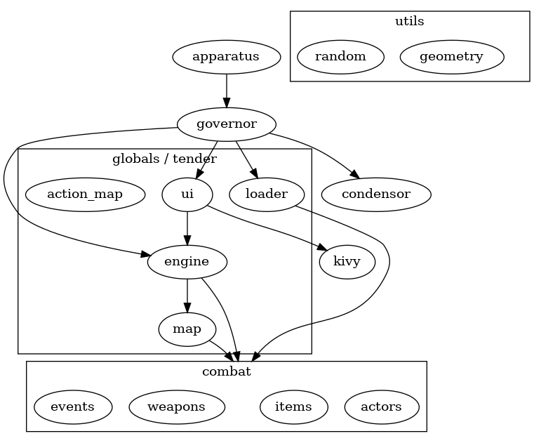

Developing Revengate
====================

## Dependencies
Most of the pure Python dependencies are specified in Pipfile. This command should install them all for you:
`pipenv sync --dev`

See if it's working by typing: 
`flit install -s`
`revcli -g`

There are many non-Python dependencies, almost all for the Android backend. On Ubuntu 21.10, this works to get you up to speed:
`sudo apt install -y build-essentials cmake java-common default-jre default-jdk and libjffi-java google-android-build-tools-24-installer android-sdk-build-tools android-sdk-platform-tools android-sdk-platform-23 android-sdk libltdl7-dev lld`

It's probably possible to simplify this list, but the errors you get come very late and are rather cryptic. 

More details are available in the Kivy official documentation:
https://buildozer.readthedocs.io/en/latest/installation.html#targeting-android

See if it's plugging an Android device over USB then typing: 
`buildozer android debug deploy run`

This will take up to 30 mins the first time, less then a minute after that. The mobile device must have [USB-debugging enabled][usb-debug]. 

[usb-debug]: https://developer.android.com/studio/command-line/adb#Enabling

## Coding style and conventions
* max line length is 88
* pos, which stands for position is always an (x, y) tuple in carterian coordinates (origin at bottom left corner).
* tile: what the environment is made of at a given pos (floor, wall, door, ...)
* funct, not func: a Python callable
* action and ftag: a string referencing a registered Python function; must be resolved before it can be called
* params, not parms
* hero: the player character, never referrer to as PC
* dialog: a popup window, when possible, use "form" or "popup" instead 
* dialogue: a conversation between actors or a speech by the narrator 
* when in doubt, name things after steam engine parts or concepts at the core of the industrial revolution

## UI paradigms
* prompt: a function to all for a user response. It can be a direct question or just a change to the environment that invites for some user input that may never come
* response: the callback function to a prompt. The callback might be registered for a single call or for every occurrences of the target user input.

## User Experience
* go with the [Material Design](https://material.io/) guidelines unless they interfere with a good game experience.

## Actions and turns
If an actor does something that counts as an action, they should be `set_played()` to 
avoid giving them the opportunity to do something else during the same turn. Most of 
the times, the actor should do it themselves, but there are a few actions that require 
more global context to be performed, such as entering a new map or dungeon. In those 
cases, the governor is the best place to call `actor.set_played()`. Calling it 
additional times during the same turn is a no-op, so when it doubt, just call it.

## Code structure
The main layers of the code are in described below:

## Artwork
Artwork must be licenced under one of CC-BY, CC-BY-SA (4.0+), CC0, or GPLv3. 

CC-NC and CC-NC-SA are not GPL compatible and are therefore not usable in this project. More details here:
https://creativecommons.org/share-your-work/licensing-considerations/compatible-licenses
https://fedoraproject.org/wiki/Licensing:Main?rd=Licensing#Content_Licenses
https://help.ubuntu.com/community/Repositories/Ubuntu

